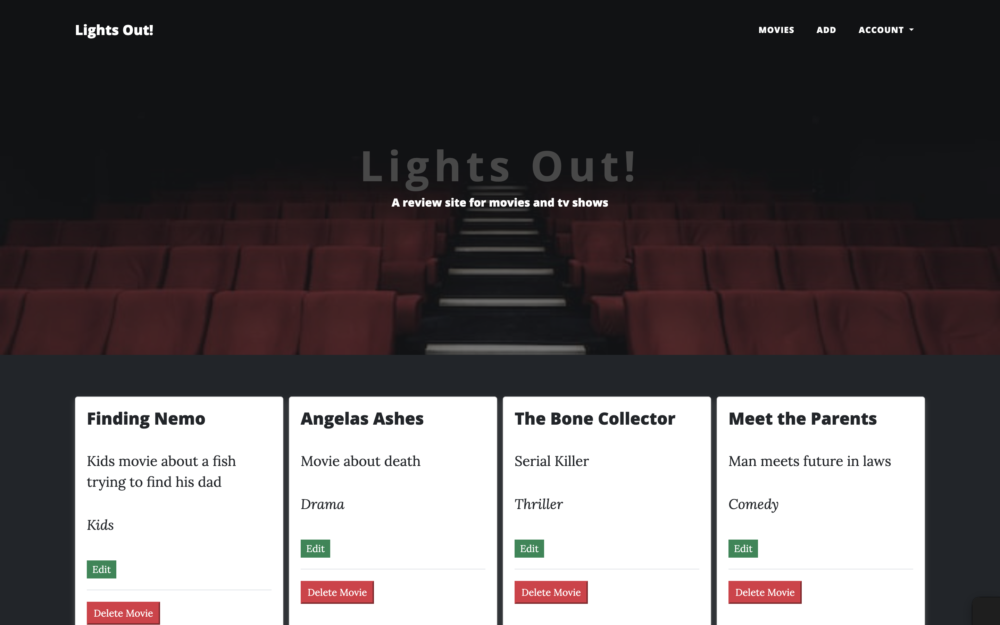
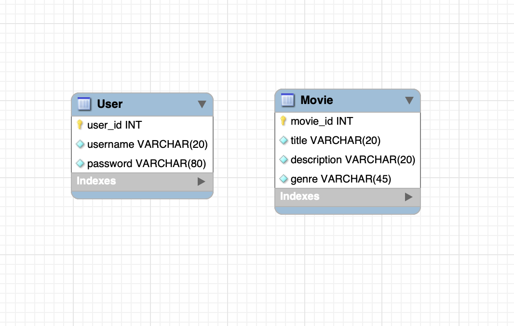
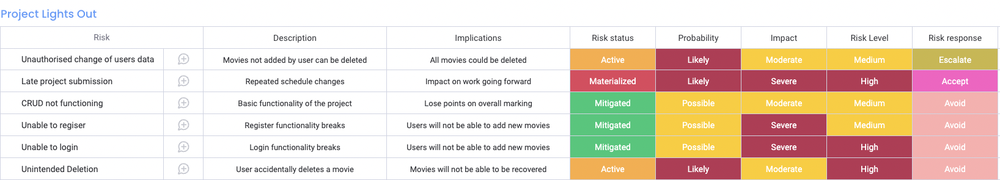

# Lights Out

I created this website for the DevOps Core Fundamental Project, at QA Learning. 

This website is a simple movie database where visitors can view, add, edit and delete movies, satisfying the CRUD criteria.

# Table of Contents
  * [UX and UI](#ux-and-ui)
    * [Project Criteria](#project-criteria)
    * [Persona and Their Goals](#persona-and-their-goals)
    * [Owner Goals](#owner-goals)
    * [User Stories](#user-stories)
  * [Design](#design)
    * [Colour Scheme](#colour-scheme)
    * [Font](#font)
    * [ERD](#erd)
    * [Risk Assessment](#risk-assessment)
    * [Favicon](#favicon)
    * [Typography](#typography)
    * [Layout](#layout)
  * [Features](#features)
    * [Existing Features](#existing-features)
    * [Features to be Implemented in Future](#features-to-be-implemented-in-future)
  * [Technologies Used](#technologies-used)
    * [Languages](#languages)
    * [Frameworks and Libraries](#frameworks-and-libraries)
  * [Testing](#testing)
    * [Manual Testing](#manual-testing)
    * [Additional Testing](#additional-testing)
    * [Resolved Bugs](#resolved-bugs)
  * [Credits](#credits)
    * [Imagery](#imagery)
    * [Code](#code)

# UX and UI

  * ## Project Criteria

    * A Trello board (or equivalent Kanban board tech) with full expansion
      on user stories, use cases and tasks needed to complete the project.
      It could also provide a record of any issues or risks that you faced
      creating your project.
    * A relational database used to store data persistently for the
      project, this database needs to have at least 2 tables in it, to
      demonstrate your understanding, you are also required to model a
      relationship.
    * Clear Documentation from a design phase describing the architecture
      you will use for you project as well as a detailed Risk Assessment.
    * A functional CRUD application created in Python, following best
      practices and design principles, that meets the requirements set on
      your Kanban Board
    * Fully designed test suites for the application you are creating, as
      well as automated tests for validation of the application. You must
      provide high test coverage in your backend and provide consistent
      reports and evidence to support a TDD approach.
    * A functioning front-end website, using Flask.
    * Code fully integrated into a Version Control System using the
    * Feature-Branch model.

  * ## Persona and Their Goals

    * The ideal visitor to this website is a movie buff.

    * They are looking for a website that allows them view and add new movies. 

  * ## Owner Goals
    1. Increase traffic to the site.
    2. Make visitors want to return and use the site again
  * ## User Stories
    1. As a user visiting the site for the first time, I want to navigate the site intuitively.
    2. As a user, I want to know what information this site provides.
    3. As a user, I want to be able to randomly generate a movie based on genre.
    6. As a user, I want to be able to access your social media accounts.
  * ## Design
    * ## Colour Scheme
      I chose my hero image first and worked from there. Its dark background with a pop of red for the seats give the visitor an immediate sense of the purpose of the website being related to movies.
    * ## Font 
      I came up with the name *Lights Out*, again because it alludes to the purpose of the website a little further. I found a nice animation which is muted until you hover over it. Once you do so the qriting lights up, and when you move your mouse away it darkens again - hence lights out!
    * ## ERD 
      
    * ## Risk Assessment

      
      
    * ## Favicon 
      I used the [Favicon.io](https://favicon.io/) website to create a simple video camera favicon, further pointing to the purpose of the website.
    * ## Typography
      I wanted a simple font for the website Open sans fit perfectly.
    * ## Layout
      The website has multiple pages. This makes more sense for the purpose of viewing all movies together, or viewing and individual movie. Login and register allow you to login and register respectively. The profile page will contain all the movies a particular user has created. Add allows a logged in user to add a *new* movie. Movies can be editied/deleted from each card. Logout logs the user out.
    * ## Existing Features
      * The website has the following features :
        * Navbar - Appears on all pages. Contains links to Home(Logo), Account > Login, Register, additionally, Profile, Add, and Logout if a user is logged in.

        * Content - All movies appear on the landing page. Login and register allow you to login and register respectively.

        * Footer - The footer contains the website name and some external links. 

    * ## Features to be Implemented in Future
      * Ability to share movies
      * Ability to rate movies
      * Ability to view and sort movies alternatively
      * Ability to view all movies a user has created on their profile
      * Ability to add images to the cards
  * ## Technologies Used
    * ## Languages
      * [HTML5](https://en.wikipedia.org/wiki/HTML5)
      * [CSS](https://en.wikipedia.org/wiki/CSS)
      * [Python](https://en.wikipedia.org/wiki/Python_(programming_language))
    * ## Frameworks and Libraries
      * [Bootstrap](https://getbootstrap.com/docs/5.0/getting-started/introduction/)
      * [Start Bootstrap](https://startbootstrap.com/)
      * [Google Fonts](https://fonts.google.com/)
      * [Font Awesome](https://fontawesome.com/)
      * [Favicon.io](https://favicon.io)
      * [Flask](https://flask.com)
      * [VS Code](https://code.visualstudio.com/)
      * [GitHub](https://github.com/)
  * ## Testing
    Testing for this website was done using the Google Chrome Browser, using Chrome Developer Tools to check the different screensizes. Testing was also done on an iPhone 8 using Safari, as sometimes Safari can cause issues with how the website renders. No such errors were found.
    * ## User Stories Testing
      User
      1. As a user visiting the site for the first time, I want to navigate the site intuitively.
         * A user can navigate around the site with ease. All components work as they should.
      2. As a user, I want to know what information this site provides.
         * A user can immediately see that this site is a website for movies.
      3. As a user, I want to be able to randomly generate a movie based on genre.
         * Functionality not achieved.
      4. As a user, I want to be able to access your social media accounts.
         * A user can find the links to the owners social media accounts in the footer.
    * ## Manual Testing 
      * Navbar & Footer
        * All links in navbar work as expected.    
      * Register
        * Allows a user to register as expected.
      * Login
        * Allows a user to login as expected.
      * Logout
        * Allows a user to logout as expected.
      * Add
        * Allows the user to add a movie as expected.
      * Edit
        * Allows the user to edit a movie, and replace the original with no duplicate. Bug found where only the first part of a string is being pulled back from the database
      * Delete
        * Allows the user to delete a movie as expected.
    * ## Additional Testing 
      * [W3C - Jigsaw Validator](https://jigsaw.w3.org/css-validator/)

      * [W3C - NU HTML Checker](https://validator.w3.org/nu/)

      * [PEP8 - Online Checker](http://pep8online.com/)

        

    * ## Resolved Bugs
      * In order to improve accessibility, I added *aria-hidden true* to Font Awesome icons that were not functional.

  * ## Credits
    * ## Code
      * Start Bootstrap's theme 'Clean Blog' was used to structure the website in order to ensure it's responsivity.
      * All code is my own unless explicitly stated in my code files in a comment.
      * Credit to other sources for some solutions that I have commented in my code.
